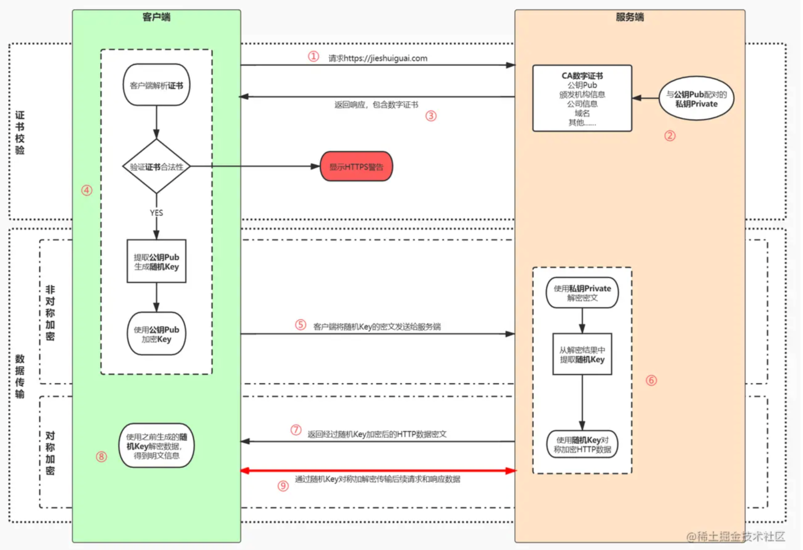

# HTTP

## 一）HTTPS 相关

HTTPS = HTTP + SSL/TLS

* SSL（Secure Socket Layer，安全套接字层）

* TLS（Transport Layer Security，传输层安全），其前身是 SSL，目前使用最广泛的是TLS 1.1、TLS 1.2

1. HTTPS 粗略步骤可以总结如下：

   1. 客户端向服务器端索要并验证公钥。 （怎么证明公钥可信）
   2. 双方协商生成"对话密钥"。 （用a步中拿到的公钥加密讨论‘对话密钥’）
   3. 双方采用"对话密钥"进行加密通信。（‘对话密钥’是对称加密，快）

2. 详细分析需要解决以下问题：

   1. 客户端怎么知道公钥可信？ 方法是服务端提供一个证书 Cert1。 Cert1中包含公钥，以及服务端的身份。（这个证书就是CA颁发的、服务端证明自己身份的证书，是服务端跟CA申请）

   2. 客户端怎么知道拿到的证书Cert1 是可信的呢？ 方法是证书上有数字签名（digit signature），这个签名是用CA的私钥生成的。

   3. 为什么有签名就可以让证书变得可信？ 

      1. 因为浏览器内有CA的公钥（预置），浏览器可以用CA的公钥去`验签`，如果是伪造的，验签会失败（非对称加密特性决定）。
      2. 为什么不直接对 csr 文件加密 作为 证书。 
         1. 理论上是可行的，浏览器只要拿着CA公钥能验签，就证明这个证书确实是CA颁发的，然后就能拿到 csr 文件内容了。
         2. 主要原因还是没必要。 因为直接对csr整个文件内容非对称加解密速度很慢，而且csr文件我明文传输就行了，没必要加密。 所以我只要对 MD 做非对称加解密就行了（MD文件内容短，加解密速度快多了）。
         3. 客户端拿到证书，先用CA公钥解密签名，得到MD；MD是一串Bytes，客户端咋知道这个是解密出来的东西是正确的呢（即验签ok呢？）？ 只要将这个MD 和 证书中csr文件内容的MD 比对一下就行了， 一致的话就说明解密成功。

      ###### 

3. 一些参考：

   1. 数字证书和数字签名，可以参考： https://network.51cto.com/article/628890.html
   2. https详解： https://juejin.cn/post/6844904127420432391
   3. 阮一峰SSL协议：https://www.ruanyifeng.com/blog/2014/02/ssl_tls.html
   4. 阮一峰翻译的数字签名和数字证书：https://www.ruanyifeng.com/blog/2011/08/what_is_a_digital_signature.html

   

## 二）长链接短连接

比较简单，基于TCP的长连接和短连接。  

* 长连接：建立TCP连接 -> 传输数据 ->。。。。 ->传输数据 -> 关闭连接

* 短连接：建立TCP连接 -> 传输数据 -> 关闭连接； 建立TCP连接 -> 传输数据 -> 关闭连接；

参考：https://www.cnblogs.com/0201zcr/p/4694945.html