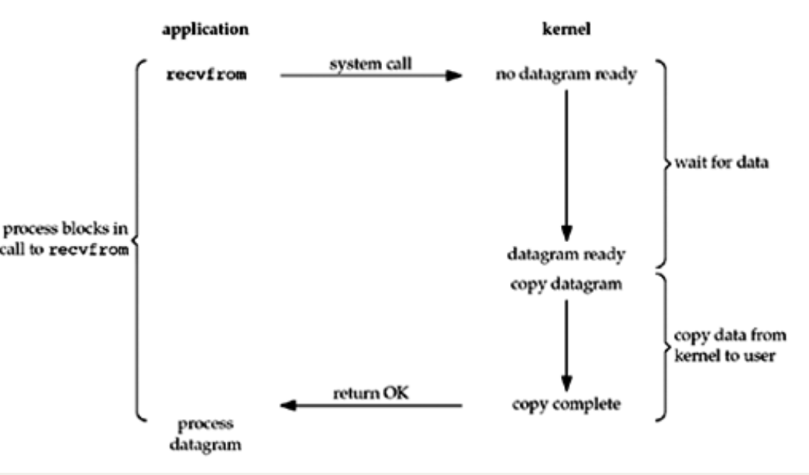
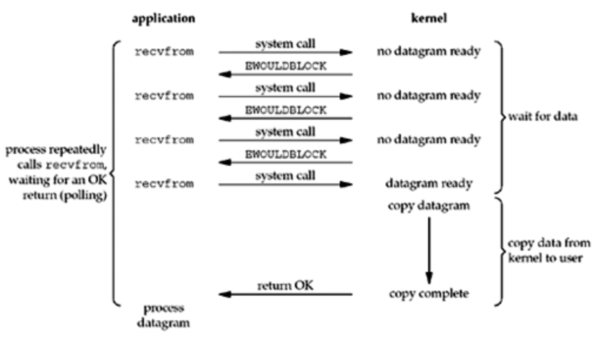
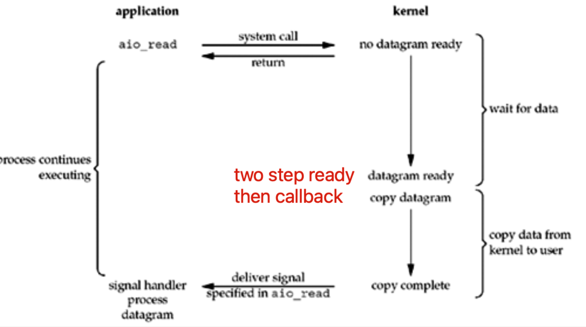
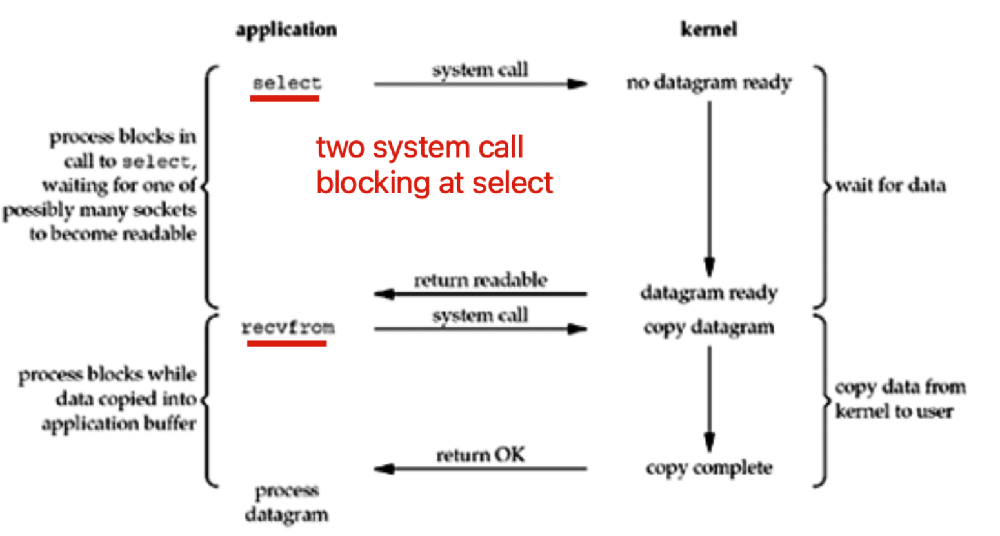

# I/O操作

### 一） BIO、NIO、AIO

**在操作系统层面来说：** IO操作分为两步，一是等待IO就绪，二是将数据从kernal space 拷贝到user space。 两步完成之后，用户线程才能读取到数据并操作。

* BIO：Blocking，阻塞IO。 读、写时线程阻塞，直到二步完成后唤起线程。

  

* NIO：Non-blocking，非阻塞IO。 读、写时线程直接返回。后续应用程序再不断地轮询（polling）数据是否就绪（是否可读写）。就绪之后由操作系统完成第二步。

  

* AIO：Asynchronize，异步IO 。 读、写时线程直接返回，操作系统完成两步之后，再通知线程继续工作（读写已经完成）。

  

  

* select、poll、epoll等都是同步IO（可阻塞可不阻塞，根据调用时传入的timeout参数决定）。他们是 **IO多路复用**，一个线程监听了所有的连接。有可用的连接之后，由用户线程去读、写数据。

Java的BIO、NIO、AIO：

java中NIO是1.4引入的，对应在java.nio包中，提供channel、selector、buffer等抽象（多路复用IO），但是java原生NIO比较难用，而Netty封装了JAVA NIO，提供了更好的抽象和API，一般网络编程直接使用Netty。JavaNIO 在linux底层是基于epoll的实现。

###  二） Reactor、Proactor

是网络框架中的两种模式。

* Reactor：主动模式。应用程序主动去轮询os或框架，IO是否就绪。
* Proactor：被动模式。os或框架完成IO，然后通知应用程序IO ready（数据已经copy到用户空间），可以操作（可直接读写用户buf了）。

### 二） select、poll、epoll

> 高并发的核心解决方案是 1个线程处理所有连接的“等待消息准备好”

1. select、poll、epoll 都是使用一个现成去监听所有的socket连接。

2. select和poll几乎一样，除了select有最大监听socket数量的限制。

3. select和poll低效是因为，它们监听的所有连接中，只要有一个连接准备就绪（可读或可写），就会返回所有连接，然后再轮训所有连接找到就绪的连接。（当数万个连接，只有几个连接就绪，则效率低下）

4. epoll高效在于他内部区分了非就绪连接和就绪连接。 非就绪连接放在一个红黑树中；就是连接放在一个链表中。 程序调用epoll_wait去处理数据时，只会轮询链表（已就绪连接）

   

### 参考

1. UNP上的官方说明，BIO，NIO，AIO：https://notes.shichao.io/unp/ch6/#io-multiplexing-model
2. epoll： https://www.cnblogs.com/lojunren/p/3856290.html
3. reactor，proactor：https://segmentfault.com/a/1190000018331509
4. io多路复用阻塞吗？ https://github.com/CyC2018/CS-Notes/issues/194