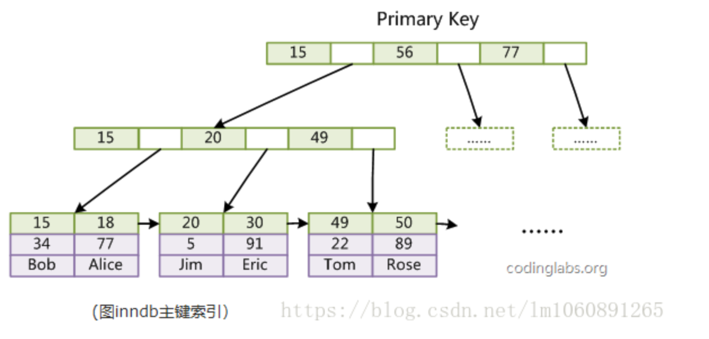
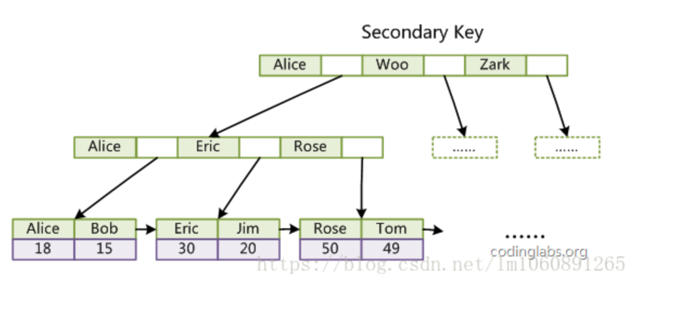
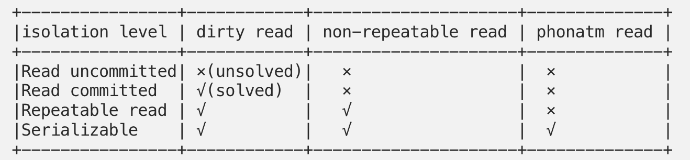

# 索引

## 1. 索引结构推导

1. 使用hash索引，快， O(1)。 但是无法解决范围查找问题
2. 使用数组做索引，快，O(1)。 但是插入删除很慢， 需要移动 O(N)元素。
3. 使用链表做索引，慢，O(N)。 需要遍历来查找元素。
4. 在 查询 和 插入删除 之间取平衡，想到 树 结构。
   1. 查找效率 O(lgN)
   2. 插入删除效率 O(lgN)
5. 树的高度直接决定了查询效率，所以希望使树尽量矮。 
   1. 中间结点不要存具体data，只存索引，这样每个中间结点就能存更多的索引数据，树就更矮
6. 要解决范围查找问题
   1. 将叶子结点的数据，全部用双向链表连接起来

## 2. 索引类型

1. 聚簇（聚集）索引：叶子结点挂着真实的行数据 （数据堆在叶子结点，所以叫聚簇，cluster）。 

   1. innoDB 按照主键聚集，如果建表时没有指定，innoDB会使用UK作为主键来聚集，如果UK也没有，innorDB会创建隐含的自增主键。

2. 非聚簇索引：其他的索引，都叫做非聚簇索引（二级索引，辅助索引）。 叶子结点索引的是 主键值

   1. 非聚簇索引，需要回表一次。因为真实row都在聚集索引的B+树上

   

​									

3. 联合索引（Composite Indexes）

   1. 联合索引最左匹配，建一个联合索引 `(col1,col2,col3)`，实际相当于建了 `(col1)`，`(col1,col2)`，`(col1,col2,col3)` 三个索引
   2. 达到覆盖索引的效果，比如上面的索引，如果查询的就是 col1,2,3 的数据，则只查索引结构即可，不需要再回表查询

4. 覆盖索引(Covering Indexes)

   

   

   1. 包含满足查询的所有列。只访问索引的查询，只需读索引而不用读数据。（避免回表，提高性能）

# 事务

## 1. 事务的隔离级别

1. 上图只是规范，如RR隔离级别不解决幻读，但是实际实现是看数据库厂商的，例如Mysql默认隔离级别RR，且解决了幻读。
2. **不可重复读 VS. 幻读（教科书式定义）：**
   1. 不可重复读：读期间记录被 <u>更新</u>了， 导致前后两次读取的数据不一样。A non-repeatable read occurs, when during the course of a transaction, a row is retrieved twice and the values within the row differ between reads. 
   2. 幻读：读期间，有记录被 <u>插入或删除</u>， 导致前后读出的记录数不一样。（记录没有被修改，还是能重复读的，只不过是多了或者少了！）A phantom read occurs when, in the course of a transaction, two identical queries are executed, and the collection of rows returned by the second query is different from the first.
3. 

