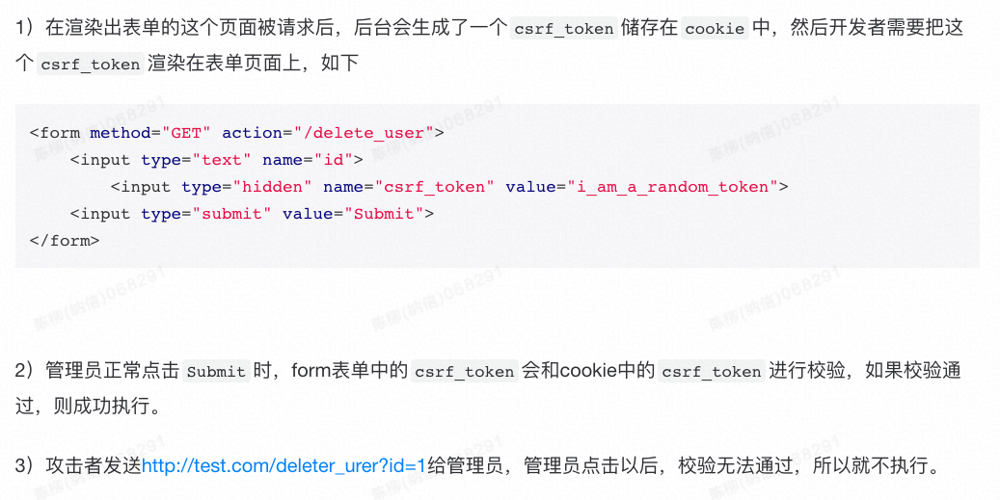

# XSS （Cross-Site Scripting） 跨站脚本攻击

直白来说，就是页面被注入了恶意的代码——用户输入的内容跳出文本的限制，成了可执行的代码。

注入脚本以后，可以干很多坏事，例如：

- 窃取 Cookie 信息，模拟用户进行登录，然后进行转账等操作
- 使用 addEventListener 监听用户行为，监听键盘事件，窃取用户的银行卡密码等。并发送到攻击者的服务器

防御：

* 输入检查：对输入内容中的 script 和 iframe 等标签进行转义或者过滤

* 设置 httpOnly(后端)： 设置此属性可防止 JavaScript 获取 Cookie, 只能在 HTTP请求过程中使用 Cookie

* 开启 CSP 白名单 ：即开启白名单，可以阻止白名单意外的资源加载和运行

# CSRF （Cross-Site Request Forge）

在a网站有登录态，攻击者发送 a.com/tranferMoney 这样的链接让用户点击，点击之后，a网站服务端无法区分 这个请求到底是 真实的用户操作， 还是第三方的攻击。 且这个操作可以执行，因为当前有a网站的登录态了。

防护：

而对于攻击者，他的这个请求 a.com/transferMoney ，里面是不会带有 csrf_token 的，所以和cookie里的csrf_token校验时不会通过