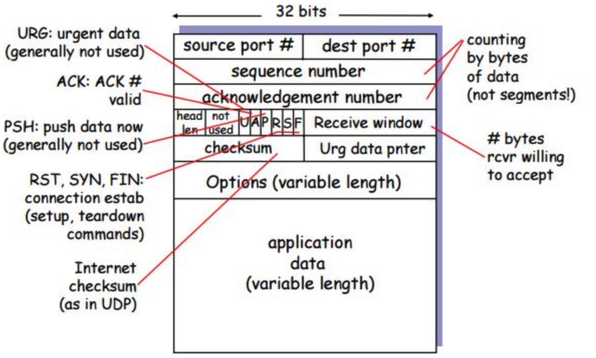
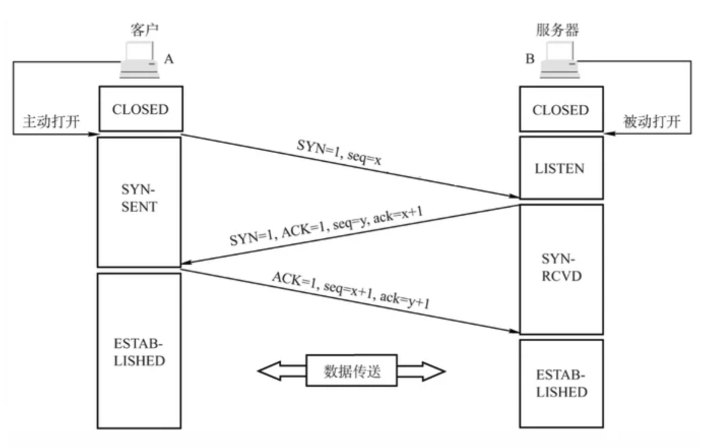

# Network

## TCP

#### 1. 概括

1. 单播、点对点双向通信（术语：全双工通信）、可靠传输。
2. 下层IP不可靠（尽最大努力交付），所以TCP需要做很多额外事情才能达到可靠交付。
   1. 传递之前建立连接
   2. 传递中：累积确认、自动重传、滑动窗口、流量控制&拥塞控制
3. TCP 并不能保证数据一定会被对方接收到，因为这是不可能的。TCP 能够做到的是，如果有可能，就把数据递送到接收方，否则就通知用户放弃重传中断连接。因此准确说它所能提供的是 **数据的可靠递送或故障的可靠通知**
4. TCP做的诸多事情，秘密都在TCP首部中。 首部有20 Byte 的固定长度，40 Byte 的可变长度。（即TCP首部最大长度 为60 Byte， 首部长度是可变的）

#### 2. 停止等待协议，    术语：ARQ （Automatic Repeat reQuest）

1. 发送 -> 等待确认 -> 再发送 ， 可以确保可靠通信（收到ack才发下一个，没收到则重传）
2. 但是问题是信道利用率太低了。 大部分时间浪费在 等待确认。
3. 协议名ARQ，自动重传，是说没收到ack时发送方会自动重新发送。 

#### 3. 滑动窗口协议，  术语：连续ARQ协议（Continuous ）

1. 该协议较复杂，是TCP精髓所在
2. 发送方： 即连续发送一个窗口内的数据，窗口内部分收到确认，则窗口前移
3. 接收方：**累积确认**，不是每个分组都确认，而是按序到达的最后一个分组确认。如到了1,2,3,5,6 ， 则 ack 3，此时如果发送方窗口已经滑动到 6,7,8,9， 则需要回退到 4,5,6,7， 即使5,6其实已经到达接收方了，也会被重传。
4. 发送端一直保持着一个 **动态的窗口** 用于发送数据。

#### 4. TCP 首部

1. 重点关注：序号、确认号、窗口（receive window）； ACK 位、SYN 位、FIN位
2. 序号：本报文第一个字节的序号。  
3. 确认号：期望收到对方下一个报文的第一个字节的序号。（如ack=1，说明开始建立连接啦，你下一个报文发过来吧，序号从1开始~ ）
4. 窗口：我当前的接收能力，receive window， 告知对方，你可发送这么多数据过来，间接作用到流量控制。
5. ACK（Acknowledge）位，确认位=1时，确认号才有效。 建立连接之后，ack一直等于1，应为数据要来回确认。
6. SYN（Synchronize）位，同步位，建立连接时使用。
7. FIN（Finish）位，结束位，断开连接时使用。

#### 5. 为什么采取3次握手

1. 第一次：SYN=1 && ACK =0  , seq =x

   1. SYN=1 && ACK=0， 表示要建立连接的请求。

   2. seq=x，发个序号，相当于做个标记，你要回过来，告诉我这个包你能收到（ack=x+1）。这样我才能确信我的发送能力是OK的。

      > 第一次之后，A不知道自己发送能力OK，也不知道自己接收能力OK
      >
      > B知道A的发送能力OK，自己的接收能力OK

2. 第二次：SYN=1 && ACK=1;    ack=x +1；  seq=321。

   1. SYN=1 && ACK=1，表示对建立连接的响应。

   2. ack = x+1， 表示收到了上一个 seq=x 的包，下一个包从 x+1 开始发。

   3. seq=y，发个序号，相当于做个标记，你要回过来，告诉我这个包你能收到（ack=y+1）。这样我才能确信我的发送能力是OK的。

      > 第二次之后，A知道自己的接收能力OK（已收到报文），且发送能力OK（前次发送的x，B已经收到，因为B回过来了 ack=x+1）； 知道B的发送能力OK（我收到东西了，说明B能发送），知道B的接收能力OK（我收到了x+1 的回应，说明B收到了我发送的 x）

3. 第三次：SYN=0 && ACK=1;  ack=y+1;  seq = x+1

   1. ack = y+1,  表示收到了上一个 seq=y的包。

      > 第三次之后，B就知道自己的接收能力OK（收到报文），且发送能力也是OK的（前次发送的y，对方已经收到，因为A回过来了y+1）； 知道A的发送能力OK（我收到东西了，说明A能发送），知道A的接收能力OK（我收到y+1的回应，说明A收到了我发的y） 

4. 总结一下：

   1. SYN=1 只有头两次，请求建立连接和响应建立连接。 其他时候都为0；
   2. ACK=0 只有头一次请求连接， 其他任何时候都为1 (包括后续的传输，中断请求)
   3. 对于报文的发送方（client or server 都一样），**发送数据后没收到响应之前，是不知道自己的 sent 能力 和 rev 能力的**。
   4. 当A接收到B的响应（第二次握手），A 就能知道 自己的发送、接收能力OK， 且对方的发送、接收能力也OK
   5. 当B接收到A的响应（第三次握手），B 就能知道 自己的发送、接收能力OK，且对方的发送、接收能力也OK

#### 6. 为什么断开连接是4次挥手

1. 第一次： A通知B要断开
2. 第二次：B同意，并发送响应。 这时候A这边就断开了，不再发数据。
3. 第三次：因为B这边还可以发，A还会继续收，所以B这边发完之后也要发一个断开连接
4. 第四次：A响应B的断开。

#### 7. 如何做的流量控制和拥塞控制

1. 流量控制： 发送方发送太快，接收方来不及处理。 

   1. 解决： 这时候接收方回复的包中的 rev-wnd 就会变小，从而通知到发送方：我已经处理不过来了，你慢点儿发。  对发送方发送速率的控制就叫做 流量控制。

2. 拥塞控制：发送方发送过去的数据，没收到反馈，然后就定时重发，一直重发。 导致网络越来越堵。 

   1. 解决：通过一些算法探知到当前网络堵车了，然后让发送方慢点儿发。

3. 区别:  流量控制是发送方收到反馈，被告知慢点儿发，点对点的。  拥塞控制则是全局性的控制，所有发送方中间路由器等都慢下来。

   

#### 8. 摘抄 & Reference

1. 客户端和服务端通信前要进行连接，“3次握手”的作用就是 `双方都能明确自己和对方的收、发能力是正常的`。
2. https://zhuanlan.zhihu.com/p/53374516
3. https://hit-alibaba.github.io/interview/basic/network/TCP.html
4. https://segmentfault.com/a/1190000039165592