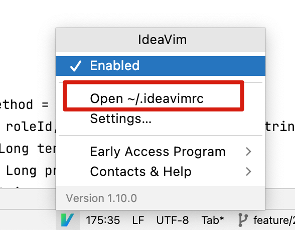

# vim

1. vimrc，自己个人的vim定制，一般不需要再自己配置了，直接使用现成的：  https://github.com/amix/vimrc。

2. 全局的 left ctrl + hjkl 键盘映射配置， 使用  karabinar， 也不需要自己编写规则，直接import Rules即可，有现成的rule。

3. IdeaVim插件，点击底部小图标，可以编辑  ideavimrc 文件，可以配置一份idea的vimrc配置。

   

   例如个人的一些配置（使用 ,u  就触发 find usage）	

   ``` bash
   "" --------------- Map IDE actions to IdeaVim -- https://jb.gg/abva4t
   " Find more examples here: https://jb.gg/share-ideavimrc
   " :actionlist   # to see all the available actions
   let mapleader=','
   
   map <leader>u <Action>(FindUsages)
   map <leader>s <Action>(SelectInProjectView)
   
   map <leader>b <Action>(ToggleLineBreakpoint)
   map <leader>o <Action>(FileStructurePopup)
   
   ```

   

4. ``` bash
   # vim 打开文件后，回到上一层
   :rew  # stand for rewind
   :e .  # edit current。  跳到当前打开文件的目录树
   
   
   ```

5. 