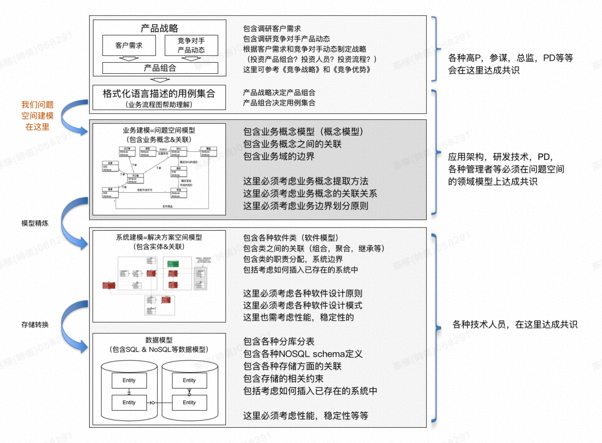
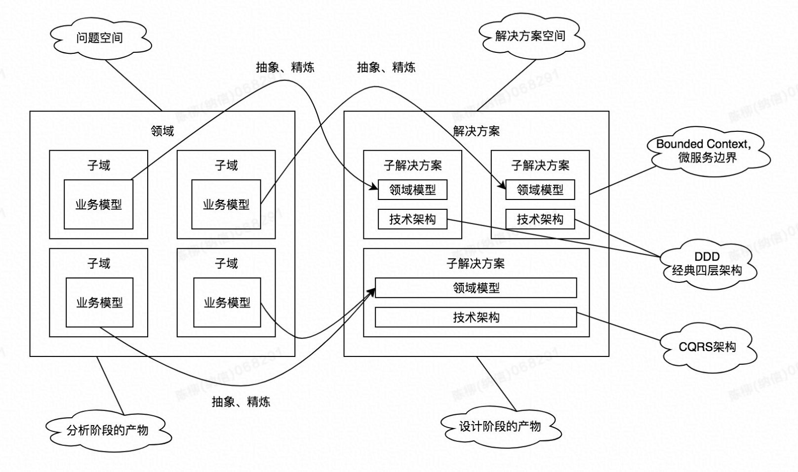

# DDD

## 1. 摘录

图解：

1. **问题空间（domain） VS 解决方案空间（bounded context）**
2. **业务建模 VS 系统建模**
3. 问题空间建模（业务分析）和解决方案空间建模（实现方案）。

> 21世纪什么最缺，既懂领域业务，又懂技术架构的人才最缺。现实情况是，PM只会协调，领域专家不懂技术，技术人才领域知识不深入

> 领域划分，本质上是考研的一个人对事物的理解能力，以及问题拆解能力
>
> 领域划分完成了，就是各个击破的时候，就是要为每个子域设计一个领域模型，让这个领域模型可以抓住需求的本质，也就是领域的本质问题。这个也很关键，这个本质上是考验的一个人对事物的抽象能力。

## 结论

1. 澄清 领域建模

   > 《DDD》中的领域模型，是设计模型 （解决方案域建模）。
   >
   > 《UML和模式应用》中的领域模型，是业务概念模型（问题域建模）。
   >
   >  
   >
   > 建模的时候要清楚自己在建模的是业务概念模型还是设计模型。业务概念模型是需求分析阶段的产物，设计模型是设计阶段的产物。 四色建模、时间风暴等是问题域建模方法 （[四色建模](https://www.infoq.cn/article/xh-four-color-modeling/?spm=ata.21736010.0.0.7b79140bFks2pl)）
   >
   >  
   >
   > 需求是PRD，最终产物是软件系统，中间有鸿沟，通过问题域建模、解决方案域建模来填平。 
   >
   >  
   >
   > 问题域建模是在分析需求，达成理解共识，为后续软件设计开发铺路。产出物是有助于搞清楚需求的一切东西（不要纠结是什么，可以是统一术语词汇，关键概念，关键对象草图、关系图、关键流程时序图等）
   >
   > 
   >
   > 对问题空间进行建模得到 **子域sub-domain和业务模型**，然后根据子域和业务模型，建立**领域模型（设计模型）和限界上下文bounded-context**，从而指导具体的落地。 我想这就是 领域驱动设计 （Domain Driven Design）名称的来源。

   

2. DDD基本流程

   > 1. 搜集用户故事（用户的原始需求）
   > 2. 整理用户故事，抽出用例（用例表达了用户对系统的需求，定义了系统的边界以及系统外部角色和系统的交互场景）
   > 3. 分析系统需求，将领域拆分为多个子域（领域是问题空间，本质上就是大问题拆分为小问题）
   > 4. 抽取每个子域的领域概念，得到概念模型（概念模型存在于问题空间）
   > 5. 将子域的概念模型**抽象**并转化为领域模型（领域模型存在于解决方案空间，这一步是难点，考验抽象能力）
   > 6. 找出领域模型中的聚合，以及每个聚合的聚合根
   > 7. 梳理聚合之间的关系
   > 8. 场景走查，检查领域模型如何满足用例需求

   

3. 实体是否要持有repo？

   > 答案：实体不要持有repo。  [stackoverflow解答](https://stackoverflow.com/questions/5694241/ddd-the-rule-that-entities-cant-access-repositories-directly)
   >
   > 不持有repo，实体里很多行为写不进去？ 例如 ShopCart 实体的 addItem()，需要加载出来当前有多少item（调用itemRepo.listItme）,然后才能判断是否可继续添加item。
   >
   > 
   >
   > 实体不应该关心存储。 实体也不应该持有其他实体的repo，否则实体会演变成大的service。
   >
   > 上例中shorcart应该持有 itemList 成员变量，而不应该持有itemRepo。
   >
   > 
   >
   > 正确的姿势：
   >
   > Entity里可以写能够复用的业务方法，维护属性变化。repo里是通用的查询、更新。
   >
   > service中：
   >
   > 1.用repo查出entity
   >
   > 2.调用Entity方法，做业务
   >
   > 3.用repo更新

   

4. 层之间的依赖关系?

   > * interfaces、application、domian、infrastructure。 这是4个大的tier，不一定严格只有这4个 maven - module。
   >
   >   例如对于一些通用服务如 MessgaeService，或者TimeUtil这类，可以有一个 common 的 maven-module来存放，所有其他的module都可以依赖common， 包括 domain module。
   >
   >   
   >
   > * 对于MyMsgListener类，监听消息然后处理业务逻辑。 之前考虑放在infra层，因为用到metaq的@Listener，然后类中要调用appService处理业务，所以导致 infra层依赖 app层。 这种依赖关系是错误的！  
   >
   >   正确的做法是把 MyMsgListener 放在App层，因为它要处理业务逻辑。在App层的Listener一样可以引用到infra层的@Listner。  message infrastructure 触发 app层, 本质上是app层向 infra注册了监听， 所以应该是app层依赖 infra层

4. DDD与CQRS

   > 简单的说，就是一个系统，从架构上把它拆分为两部分：命令处理（写请求）+查询处理（读请求）。然后读写两边可以用不同的架构实现，以实现CQ两端（即Command Side，简称C端；Query Side，简称Q端）的分别优化。CQRS作为一个读写分离思想的架构，在数据存储方面，没有做过多的约束。可以共享数据也可以代码和数据都分离。

   

5. 领域专家

   > 如果你不了解领域知识，就算你领域建模的能力再强，各种技术架构能力再强也是使不上力。领域专家不是某个固定的角色，而是某一类人，这类人对这个领域非常了解，对领域内的各种业务场景和各种业务规则也非常清楚。

6. 微服务和DDD

   > 微服务，服务拆分的依据应该是业务。例如电商平台是一个大的业务，包括会员、商品、交易、营销等。 商品又可以再细分详情、库存等。
   >
   > DDD中的Bounded-Context的概念，正好可以和微服务的边界完全契合
   >
   > 具体划分粒度多细：
   >
   > 1. 考虑DDD分析后的业务域，有哪些domain
   > 2. 考虑高内聚低耦合
   > 3. 考虑业务发展阶段和当前团队人数情况

7. DDD战略设计

   > 
   >
   > - 领域=问题域=问题空间=业务边界(通常口语中说的‘这块业务’)
   > - 每个粒度的问题域都会推导出一个 ‘业务模型’
   > - 领域拆分、业务模型，是需求分析阶段该做的事情
   > - 解决方案的边界即BC，解决方案可拆分。  sub-domain 和 BC 不一定是一一对应的。
   > - 每个粒度的解决方案都会推导出一个 ‘领域模型’
   > - 解决方案拆分、领域建模，是软件设计阶段该做的事情
   > - BC边界即微服务边界，不同BC内的解决方案的架构可以是不同的，也即每个微服务的架构可以不同

**未归档：**

1. ddd的引入，为什么要ddd

   1. 微服务如何拆分没有理论依据，ddd中 Bounded Context 恰好提供拆分依据。 按照ddd中界限上下文来拆分，即按照业务耦合度来拆分。（划分领域边界，再根据这些领域边界从业务视角来划分微服务边界）

   2. 强调业务的重要性，强调理解业务，对业务合理建模

   3. 强调业务概念显性化出来。 原来是一段 transaction script， 现在是一个 业务实体+实体行为

   4. 但是今天我们在做业务研发时，更多的会去关注一些宏观的架构，比如SOA架构、微服务架构（纯技术），而忽略了应用内部的架构设计（关注业务本身），很容易导致代码逻辑混乱，很难维护

      

2. 战略和战术

   1. 战略（偏业务）： 业务分析，确定领域模型、划分领域、确定领域边界、建立统一语言
   2. 战术（偏技术）：实体、值对象、聚合根，领域服务，资源库，代码分层等技术指导。

3. Domian，subDomain，BoundedContext

   1. domain/subDomain： 业务问题域。 每一个细分领域，其实都有一个知识体系。

   2. BC： 解空间。

   3. 问题空间和解空间。 针对问题空间可以设计出很多个解空间

      

4. 实体、值对象

   1. 将关键业务概念抽象出来，形成实体或者值对象。 **业务概念显性化**
   2. **领域原语**。 DomainPrimitive， 比如账号域，有Account，Address，Phone等。 DSL
   3. 有了DSL的好处
      1. 概念显性出来了
      2. 业务逻辑收敛起来了
      3. 通过原语对象的组装，来实现业务逻辑，可扩展性增加了（对比原来的事务脚本）。 有点类似原子能力的组装来增加可扩展性
      4. 在事务脚本式的架构下，一般做第一个需求都非常的快，但是做第N个需求时需要的时间很有可能是呈指数级上升的，绝大部分时间花费在老功能的重构和兼容上（类似的linux管道命令，基建原子命令做好了之后，后续的新命令就可以基于已有的基建命令很快实现了）
   4. 行为和属性尽量放在一起。 面向对象的 **信息专家** 原则。
   5. 领域层尽量多的 **吃掉业务逻辑** 。  将业务领域知识沉淀掉，构建一套业务原语（DSL）
   6. 做新功能时，基于已有的DP来做，代码复用

5. 聚合

   1. 将实体、值对象组装在一起，作为一个整体被访问
   2. 聚合内对象可互相引用，聚合外通过聚合ID引用，这样容易梳理清楚这么对对象的关系。
   3. 设计尽量小的聚合，因为不够灵活。
