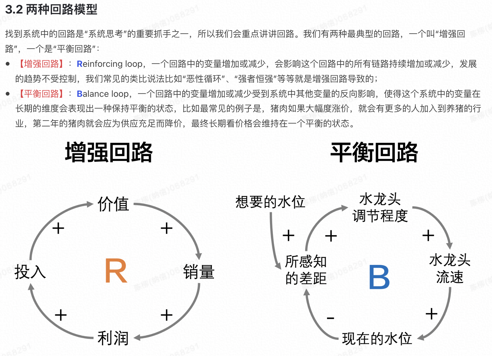
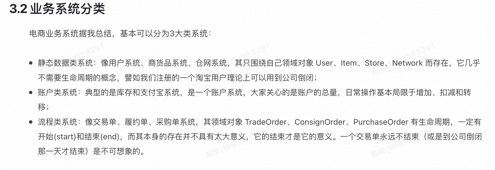

# Quotes

## ComputerScience

1. >  压缩的本质是按照一定步长对数据进行匹配扫描，**当发现重复部分的时候进行编码转换**，通过标识符来节省空间。数据中的重复项越多，压缩率一般就越高，那么数据量就越小，从而数据在网络中的传输就越快，对网络带宽和磁盘IO的压力就越小。什么样的数据最具有重复性呢，**很明显就是同一列字段的数据！**

2. > 在分布式领域，**计算移动比数据移动更加划算**，网络传输的代价是比较大的，所以更聪明的做法是将数据分布到各个服务器上，**将数据的计算查询直接下推到数据所在的服务器**。

3. > **本质复杂度 和 偶然复杂度**
   >
   > Fred Brooks 在经典著作《人月神话》的「没有银弹」一文中对于软件复杂度有着精彩的论述，他将软件复杂度分为**本质复杂度**（Essential Complexity）和**偶然复杂度**（Accidental Complexity）。这里的本质和偶然两个词来源于亚里士多德的《形而上学》，在亚里士多德那里，本质属性是一个物体必然拥有的属性，偶然属性是一个物体可以拥有的属性（也可以不拥有）。例如，一个电商软件必然会包含交易、商品等业务复杂度，因此我们称它们为本质复杂度；而同一个电商软件，可以是基于容器技术实现（也可以不是），可以是基于 Java 编写的（也可以不是），因此我们称由于容器技术或者Java 技术而引入的复杂度，为偶然复杂度。

4. >  Fred Brooks 所描述的软件本质复杂度，指的就是来自问题域本身的复杂度，除非缩小问题域的范k围，否则是无法消除本质复杂度的。而偶然复杂度是由于由于解决方案带来的，例如选择了 Java，选择了容器，选择了中台，等等。此外，我们可以从所谓**问题空间**（Problem Space）和**方案空间**（Solution Space）来理解这两个复杂度，问题空间就是现实的初始状态和期望状态，以及一系列约束规则（我们常常称之为业务），方案空间就是工程师设计实现的，一系列从初始状态达到期望状态的步骤。缺乏经验的工程师往往在还没理解清楚问题的情况下就急于写代码，这便是缺乏对于问题空间和方案空间的理解，而近年来领域驱动设计为那么多工程师所推崇，其核心原因就是它指导了大家去重视问题空间，去直面本质复杂度。Eric Evans 在 2003 年的著作《Domain Driven Design》，其副标题是 “Tackling Complexity in the Heart of Software”，我想这也不是偶然。

5. >  软件研发的核心职责之一是关注软件复杂度，通过开放代码、文档，Code Review 等方式让软件复杂度的信息透明，并且让所有在增加/降低复杂度的行为透明，并且持续激励那些消除复杂度的行为

6. > Our jobs isn't just to write code, navigating organisations and achieving consensus between a lot of teams/technologies is a huge part of it.

7. > 康威定律。 混乱的组织结果会导致混乱的系统结构，最终导致无法理解的系统复杂度

8. > API vs. SPI
   >
   > 1. 使用接口者拥有的接口叫做**SPI**：使用者（人类）决定了接口的规格，实现者根据规格提供实现（杯子）。一般来讲，SPI先产生，实现后产生；一个SPI有多个实现。好的SPI命名不用**I**打头(Holdable)
   > 2. 实现者拥有的接口叫做**API**：实现者规定了接口的规格。一般来讲，先写功能，然后再包接口；一个API通常只有一个实现。API命名可以用**I**打头（IMerchantService）

9. > *All problems in computer science can be solved by another level of indirection, except of course for the problem of too many indirections. - David Wheeler.  所有问题都能通过加一个间接层来解决。

10. > In computer programming and software engineering, the ninety-ninety rule is a humorous aphorism that states: The first 90 percent of the code accounts for the first 90 percent of the development time. The remaining 10 percent of the code accounts for the other 90 percent of the development time.

11. > In computer programming and software engineering, the ninety-ninety rule is a humorous aphorism that states: The first 90 percent of the code accounts for the first 90 percent of the development time. The remaining 10 percent of the code accounts for the other 90 percent of the development time. — Tom Cargill, Bell Labs  [wiki](https://en.wikipedia.org/wiki/Ninety%E2%80%93ninety_rule)

12. > Pull VS. Poll.   拉取vs轮询，不要搞错
    >
    > Clients may both "poll" a server and "pull" data from a server

13. > 日本低结婚率： 宠物解决了情感寄托，性用品解决了性欲 《静说日本》--日本社会的最大危机

## GENERAL

1. >  Being well-educated just means you are confused on a higher level

2. >  "If you can't solve the problem create a world where the problem doesn't exist" Engineer thinking

3. > 任何试图浮于表面、疏于投入就想了解并解决一个复杂问题的傲慢做法，最终都只能接受无情的打脸

4. 

   

5. 

6. 

7. >  隐性知识: 没有人是通过看说明书学会使用手机的，也没有人是通过看游泳教程学会游泳的。我们每个人都会骑自行车，但是要教会别人骑车，我们会怎么做呢？会学骑车这样的知识，就是隐性知识。它是在做一件事情的过程中掌握的知识，实践出来并领会的知识，通常难以表达（或者说表达出来会太过琐碎）

8. > there is no stupid people, there is only misaligned priorities! 

## Soft Skill

> “管理是艺术，而不是技术”，技术处理标准品， 艺术则是每一件都不一样 ；）

> 
